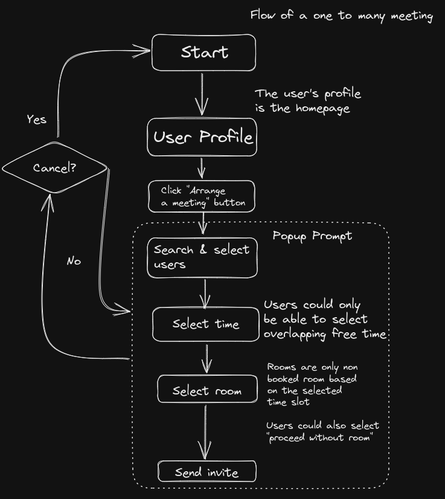
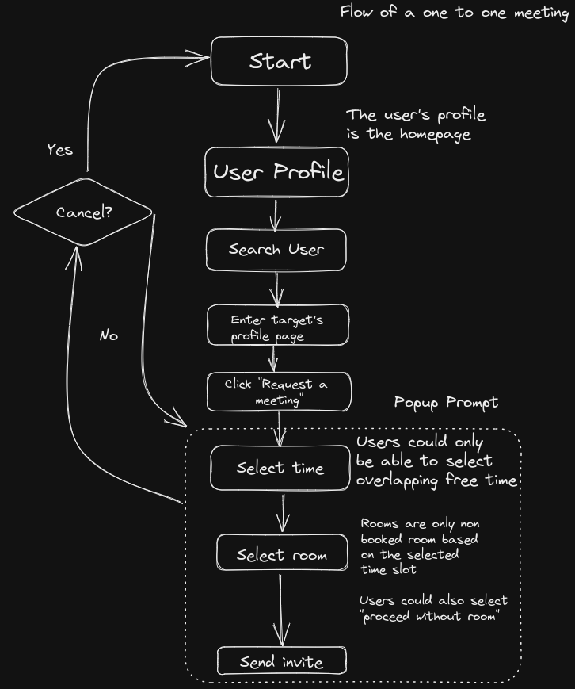
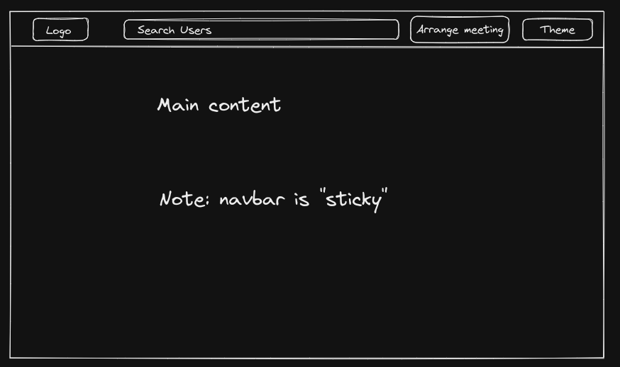

# Project Waves

## :milky_way: 1. Origin Story 

It is often difficult to co-ordinate and arrange meetings, especially for a large group where people have different timetables.

Even though we have tools like When2Meet that facilitates this process, it is still not a streamlined experience.

And as a wise man once said:
> "Idk bro, When2Meet is kinda shit" - Aristotle (probably)

Which is how this project was born, where we seek to make a webapp that streamlines and provide a better experience when it comes to arranging meetings.

## :ocean: 2. Waves 

### NOTE: I'm busy, a more comprehensive version will come soon.

### 2.1. Product Introduction 

When it comes to arranging meetings, it is often a headache to decide on the *when* and *where*. Which is what this product is aiming to solve.

### 2.2. Features 

* Core
    * Login & Registration
        * Personalized Account
        * Profile Pic
        * Username
        * User introduction
        * Personal Calendar

    * Meeting arrangement system
        * Sending meeting invites
        * Accept / Decline meeting invites

* Extended
    * Friend system
    * Blocking
    * Meeting groups
    * Recurring meetings
    * List recent searches (user)
    * Automated email upon acceting the meeting
    * Email verification (Auth)
    * Customized visibility (public / private)

### 2.3. General Flow 

#### 2.3.1. Arraning a one to many meeting

#### 2.3.2. Arranging a one to one meeting

## :paintbrush: 3. Design 

### NOTE: Only covers very little 

### 3.1. General website structure

----

### TODO

### 3.2. Login page

### 3.3. Registration page

### 3.4. Profile page

### 3.5. Component - Search users

### 3.6. Popup prompt - Search & select users

### 3.7. Popup prompt - Select time

### 3.8. Popup prompt - Select room

----

## :memo: 4. Technical Specifications

### 4.1. Stack

* To be decided 
* **Leon** is voting for `MERN`, I'm looking for others
* One thing for sure is that `TailwindCSS` will the main tool for styling

### 4.2. Style guide 

* `JS / JSX / TS / TSX`: Indent -> 2 spaces
* `Vanilla CSS`: Indent -> 4 spaces
* `Chocolate CSS`: Does not exist 

### 4.3. API

* Later, no time for now
